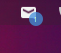

# Gnome-Mail-Tray-Icon
# 

Utilizes Gnome Online Accounts to login to Gmail/Outlook and check your incoming email

## Installation

1. Install gnome-shell version 3.22 or later.

2. Sign in with your Google and/or Microsoft account in Gnome Online Accounts settings.

## Screenshot

## Troubleshooting

1. For any errors, try rebooting or signing back in to your Gnome Online Accounts. 
2. To see logs, enter `journalctl | grep "Gnome-Mail-Tray-Icon"` into terminal. 

